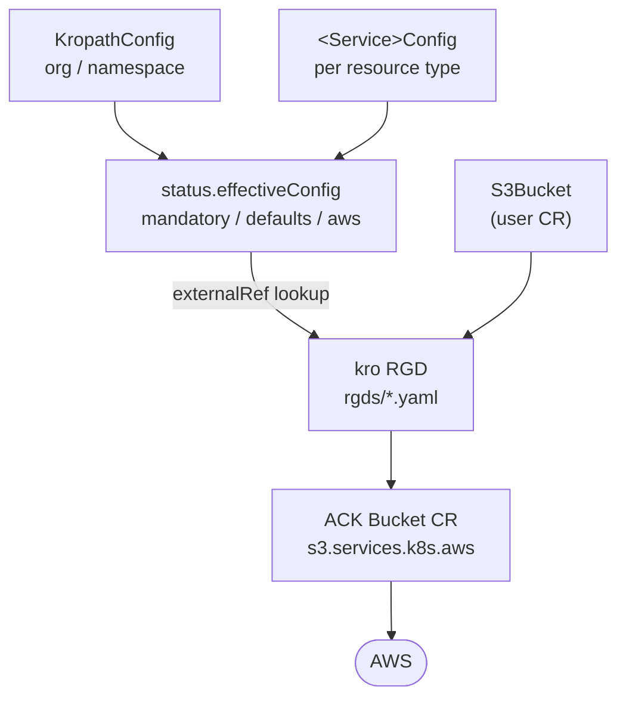

# kropath-aws

[](https://github.com/kropath/kropath-aws/actions/workflows/rgd-tests.yaml)
[](https://github.com/kropath/kropath-aws/actions/workflows/crd-classification-check.yml)
[](LICENSE)

kropath-aws is the governance and production-knowledge layer for Kubernetes-native AWS cloud
resource provisioning. It ships [kro](https://github.com/kubernetes-sigs/kro)
ResourceGraphDefinitions (RGDs) that wrap
[AWS Controllers for Kubernetes (ACK)](https://aws-controllers-k8s.github.io/community/) resources,
plus governance CRDs that let a platform team declare mandatory settings, defaults, naming
conventions, and tagging policy once and have every resource inherit them.

> ### ⚠️ EXPERIMENTAL
>
> **This project is under active development and is not production-ready.** APIs, schemas, and
> resource kinds may change without notice, and there are no compatibility guarantees between
> commits.
>
> CI validates RGDs against a local [kind](https://kind.sigs.k8s.io/) cluster running kro with
> ACK **CRD schemas only** — no ACK controllers and no AWS credentials. **Integration testing
> against a live AWS environment is currently in progress and runs outside CI.** Cloud-side
> behaviour (real resource creation, ARNs, drift, deletion semantics) is therefore not yet
> covered by the automated suite in this repository.

---

## Why

ACK gives you a Kubernetes CR per AWS resource, but it has no opinion about *governance*: every
team re-invents naming, tagging, encryption defaults, and deletion policy in their own manifests,
and nothing stops an application team from overriding a security-mandated setting.

kropath-aws adds a governance layer on top:

- **Platform teams** declare policy in `KropathConfig` (org/namespace-wide) and per-service
  `<ServiceName>Config` CRs — mandatory values, defaults, naming templates, and synced
  labels/annotations/tags.
- **Application teams** create a simple kropath resource CR (`S3Bucket`, `IAMRole`,
  `LambdaFunction`, …) with only the fields they care about.
- **kro** merges the two into the underlying ACK CR, resolving the effective configuration with a
  strict precedence: **mandatory > user spec > defaults**.

## How it works



Key conventions:

| Concept | Rule |
|---|---|
| Config lookup | One `externalRef` per RGD (`effCfg`), matched by `selector.matchLabels` on `aws.kropath.run/resource-name` |
| Precedence | `mandatory` (wins) → user `spec` → `defaults` |
| Naming | `namingTemplate` (default `{namespace}-{name}`) produces `effectiveName`, used as the cloud resource name |
| ARN | `status.predictedArn` is computed from `effectiveName`; `status.arn` is only populated by a live AWS reconciliation |
| Deletion | `metadata.annotations["services.k8s.aws/deletion-policy"]` — `retain` or `delete` |
| Label prefix | `aws.kropath.run/` for Kubernetes labels/annotations; cloud tags use plain keys |

Full engineering standards live in [`docs/STANDARDS.md`](docs/STANDARDS.md) (AWS deltas) and in
the canonical `kropath-core/docs/standards/engineering-standards.md`.

## Repository layout

| Path | Contents |
|---|---|
| `rgds/` | kro ResourceGraphDefinitions — one per AWS resource kind (227 kinds) |
| `crds/` | Governance CRDs only: `KropathConfig` plus 57 per-service `<Service>Config` CRDs |
| `crds/policy/` | `PolicyDocument` CRD for reusable IAM policy documents |
| `profiles/` | Ready-to-apply governance profiles — a `general-policy` baseline per service (52 of 57 services; `athena`, `iam`, `managedprometheus`, `opensearch`, and `route53` don't have one yet), plus stricter variants where they exist |
| `tests/` | 289 Chainsaw suites, a `Makefile` per-service target, and cluster setup/teardown |
| `hack/` | Local cluster bootstrap and provider-CRD installation scripts |
| `docs/` | Standards, the RGD error catalog, and dated troubleshooting logs |

## Implementation status

**227 resource RGDs** across 57 services, **59 governance CRDs**, and **289 Chainsaw test suites**
covering **4,808 test cases**.

### Services with resource RGDs

**Suites** counts `chainsaw-test.yaml` files; **Test cases** counts the behavioural steps inside
them (setup and purge steps excluded). **AWS integration** tracks end-to-end validation against a
live AWS account with real ACK controllers, exercised outside this repo's CI in a separate
integration-test harness (`kropath-aws-integration-tests`). That harness already maintains live
resource fixtures for S3, SNS, and SQS, and has confirmed the governance cascade for Lambda against
a real cluster, but the only fully-investigated resource run so far — S3 — surfaced a real,
still-open reconciliation bug. A service only moves to `✅ Verified` once it has a confirmed, clean,
end-to-end passing run with no open issues; none has reached that bar yet, so every row below is
still `⏳ Pending`.

| Service | RGD kinds | Config CRD | Suites | Test cases | AWS integration |
|---|---|---|---|---|---|
| ACM (Certificate Manager) | `ACMCertificate`, `ACMEDomainValidation`, `ACMEEndpoint`, `ACMPrivateCA`, `ACMPrivateCertificate` | `ACMConfig` | 6 | 83 | ⏳ Pending |
| API Gateway (v1) | `APIGatewayAPIKey`, `APIGatewayAuthorizer`, `APIGatewayDeployment`, `APIGatewayRestAPI`, `APIGatewayVPCLink` | `APIGatewayConfig` | 6 | 94 | ⏳ Pending |
| API Gateway v2 | `ApiGatewayV2ApiMapping`, `ApiGatewayV2DomainName`, `ApiGatewayV2HttpApi`, `ApiGatewayV2Stage`, `ApiGatewayV2VpcLink`, `ApiGatewayV2WebSocketApi` | `ApiGatewayV2Config` | 7 | 86 | ⏳ Pending |
| Amazon MQ | `MQBroker` | `MQConfig` | 2 | 77 | ⏳ Pending |
| Application Auto Scaling | `AppScalingPolicy`, `AppScalingTarget` | `AppScalingConfig` | 3 | 57 | ⏳ Pending |
| Athena | `AthenaDataCatalog`, `AthenaPreparedStatement`, `AthenaWorkGroup` | `AthenaConfig` | 4 | 68 | ⏳ Pending |
| Aurora DSQL | `DSQLCluster` | `DSQLConfig` | 2 | 30 | ⏳ Pending |
| Auto Scaling | `AutoScalingGroup` | `AutoScalingConfig` | 2 | 61 | ⏳ Pending |
| Backup | `BackupPlan`, `BackupSelection`, `BackupVault` | `BackupConfig` | 4 | 63 | ⏳ Pending |
| Bedrock | `BedrockAPIKeyCredentialProvider`, `BedrockAgent`, `BedrockAgentRuntime`, `BedrockAgentRuntimeEndpoint`, `BedrockBrowser`, `BedrockBrowserProfile`, `BedrockCodeInterpreter`, `BedrockGateway`, `BedrockGatewayTarget`, `BedrockHarness`, `BedrockHarnessEndpoint`, `BedrockInferenceProfile`, `BedrockMemory`, `BedrockPolicy`, `BedrockPolicyEngine`, `BedrockWorkloadIdentity` | `BedrockConfig` | 17 | 273 | ⏳ Pending |
| CloudFront | `CloudFrontCachePolicy`, `CloudFrontConnectionGroup`, `CloudFrontDistribution`, `CloudFrontDistributionTenant`, `CloudFrontFunction`, `CloudFrontOriginAccessControl`, `CloudFrontOriginRequestPolicy`, `CloudFrontResponseHeadersPolicy`, `CloudFrontVPCOrigin` | `CloudFrontConfig` | 10 | 163 | ⏳ Pending |
| CloudTrail | `CloudTrailEventDataStore`, `CloudTrailTrail` | `CloudTrailConfig` | 3 | 73 | ⏳ Pending |
| CloudWatch | `CloudWatchAlarm`, `CloudWatchDashboard`, `CloudWatchMetricStream` | `CloudWatchConfig` | 4 | 85 | ⏳ Pending |
| CloudWatch Logs | `CloudWatchLogsLogGroup` | `CloudWatchLogsConfig` | 2 | 40 | ⏳ Pending |
| CodeArtifact | `CodeArtifactDomain`, `CodeArtifactPackageGroup` | `CodeArtifactConfig` | 3 | 41 | ⏳ Pending |
| Cognito | `CognitoUserPool` | `CognitoConfig` | 2 | 49 | ⏳ Pending |
| DocumentDB | `DocumentDBCluster`, `DocumentDBInstance`, `DocumentDBSubnetGroup` | `DocumentDBConfig` | 4 | 90 | ⏳ Pending |
| DynamoDB | `DynamoDBTable` | `DynamoDBConfig` | 2 | 56 | ⏳ Pending |
| EC2 | `EC2DHCPOptions`, `EC2ElasticIP`, `EC2FlowLog`, `EC2Instance`, `EC2InternetGateway`, `EC2LaunchTemplate`, `EC2NATGateway`, `EC2NetworkACL`, `EC2PrefixList`, `EC2RouteTable`, `EC2SecurityGroup`, `EC2Subnet`, `EC2TransitGateway`, `EC2TransitGatewayAttachment`, `EC2VPC`, `EC2VPCEndpoint`, `EC2VPCPeering` | `EC2Config` | 18 | 206 | ⏳ Pending |
| ECR | `ECRPullThroughCacheRule`, `ECRRepository`, `ECRRepositoryCreationTemplate` | `ECRConfig` | 4 | 68 | ⏳ Pending |
| ECR Public | `ECRPublicRepository` | `ECRPublicConfig` | 2 | 19 | ⏳ Pending |
| ECS | `ECSCapacityProvider`, `ECSCluster`, `ECSService`, `ECSTaskDefinition` | `ECSConfig` | 5 | 105 | ⏳ Pending |
| EFS | `EFSAccessPoint`, `EFSFileSystem`, `EFSMountTarget` | `EFSConfig` | 4 | 70 | ⏳ Pending |
| EKS | `EKSAccessEntry`, `EKSAddon`, `EKSCluster`, `EKSFargateProfile`, `EKSIdentityProviderConfig`, `EKSNodegroup`, `EKSPodIdentityAssociation` | `EKSConfig` | 8 | 88 | ⏳ Pending |
| ELBv2 | `ELBListener`, `ELBLoadBalancer`, `ELBRule`, `ELBTargetGroup` | `ELBConfig` | 5 | 116 | ⏳ Pending |
| EMR | `EMRJobRun`, `EMRServerlessApplication`, `EMRVirtualCluster` | `EMRConfig` | 4 | 87 | ⏳ Pending |
| ElastiCache | `ElastiCacheCluster`, `ElastiCacheParameterGroup`, `ElastiCacheReplicationGroup`, `ElastiCacheServerless`, `ElastiCacheSubnetGroup`, `ElastiCacheUser`, `ElastiCacheUserGroup` | `ElastiCacheConfig` | 8 | 90 | ⏳ Pending |
| EventBridge | `EventBridgeArchive`, `EventBridgeEndpoint`, `EventBridgeEventBus`, `EventBridgeRule` | `EventBridgeConfig` | 5 | 66 | ⏳ Pending |
| EventBridge Pipes | `PipesPipe` | `PipesConfig` | 2 | 39 | ⏳ Pending |
| Glue | `GlueJob` | `GlueConfig` | 2 | 55 | ⏳ Pending |
| IAM | `IAMGroup`, `IAMIdentityProvider`, `IAMPolicy`, `IAMRole`, `IAMUser` | `IAMConfig` | 9 | 107 | ⏳ Pending |
| KMS | `KMSGrant`, `KMSKey` | `KMSConfig` | 3 | 71 | ⏳ Pending |
| Keyspaces | `KeyspacesKeyspace`, `KeyspacesTable` | `KeyspacesConfig` | 3 | 58 | ⏳ Pending |
| Kinesis | `KinesisStream` | `KinesisConfig` | 2 | 33 | ⏳ Pending |
| Lambda | `LambdaAlias`, `LambdaCodeSigningConfig`, `LambdaEventSourceMapping`, `LambdaFunction`, `LambdaFunctionURLConfig`, `LambdaLayerVersion`, `LambdaVersion` | `LambdaConfig` | 8 | 128 | ⏳ Pending |
| MSK | `MSKCluster`, `MSKConfiguration`, `MSKServerlessCluster`, `MSKVPCConnection` | `MSKConfig` | 5 | 159 | ⏳ Pending |
| MWAA (Managed Airflow) | `MWAAEnvironment` | `MWAAConfig` | 2 | 49 | ⏳ Pending |
| Managed Prometheus (AMP) | `ManagedPrometheusAlertManagerDefinition`, `ManagedPrometheusLoggingConfiguration`, `ManagedPrometheusRuleGroupsNamespace`, `ManagedPrometheusWorkspace` | `ManagedPrometheusConfig` | 5 | 61 | ⏳ Pending |
| MemoryDB | `MemoryDBACL`, `MemoryDBCluster`, `MemoryDBParameterGroup`, `MemoryDBSnapshot`, `MemoryDBSubnetGroup`, `MemoryDBUser` | `MemoryDBConfig` | 7 | 106 | ⏳ Pending |
| Network Firewall | `NetworkFirewallFirewall`, `NetworkFirewallPolicy`, `NetworkFirewallRuleGroup` | `NetworkFirewallConfig` | 4 | 104 | ⏳ Pending |
| OpenSearch | `OpenSearchCollection`, `OpenSearchDomain`, `OpenSearchSecurityPolicy`, `OpenSearchVPCEndpoint` | `OpenSearchConfig` | 5 | 92 | ⏳ Pending |
| Organizations | `OrganizationsAccount`, `OrganizationsOU` | `OrganizationsConfig` | 3 | 52 | ⏳ Pending |
| QuickSight | `QuickSightAnalysis`, `QuickSightDashboard`, `QuickSightDataSet`, `QuickSightDataSource` | `QuickSightConfig` | 5 | 94 | ⏳ Pending |
| RAM (Resource Access Manager) | `RAMPermission`, `RAMResourceShare` | `RAMConfig` | 3 | 46 | ⏳ Pending |
| RDS | `RDSCluster`, `RDSClusterParameterGroup`, `RDSInstance`, `RDSParameterGroup`, `RDSProxy`, `RDSSubnetGroup` | `RDSConfig` | 7 | 123 | ⏳ Pending |
| Recycle Bin | `RecycleBinRule` | `RecycleBinConfig` | 2 | 37 | ⏳ Pending |
| Route 53 | `Route53HealthCheck`, `Route53HostedZone`, `Route53RecordSet`, `Route53ResolverEndpoint`, `Route53ResolverQueryLogConfig`, `Route53ResolverQueryLogConfigAssociation`, `Route53ResolverRule`, `Route53ResolverRuleAssociation` | `Route53Config` | 9 | 134 | ⏳ Pending |
| S3 | `S3Bucket` | `S3Config` | 2 | 97 | ⏳ Pending |
| S3 Advanced (Tables, Vectors, Files, Control) | `S3ControlAccessPoint`, `S3FilesAccessPoint`, `S3FilesFileSystem`, `S3FilesMountTarget`, `S3TablesNamespace`, `S3TablesTable`, `S3TablesTableBucket`, `S3VectorsIndex`, `S3VectorsVectorBucket` | `S3AdvancedConfig` | 10 | 124 | ⏳ Pending |
| SES | `SESConfigurationSet` | `SESConfig` | 2 | 22 | ⏳ Pending |
| SNS | `SNSSubscription`, `SNSTopic` | `SNSConfig` | 3 | 83 | ⏳ Pending |
| SQS | `SQSQueue` | `SQSConfig` | 2 | 56 | ⏳ Pending |
| SageMaker | `SageMakerDataQualityJobDefinition`, `SageMakerDomain`, `SageMakerEndpoint`, `SageMakerEndpointConfig`, `SageMakerFeatureGroup`, `SageMakerHyperParameterTuningJob`, `SageMakerModel`, `SageMakerModelBiasJobDefinition`, `SageMakerModelExplainabilityJobDefinition`, `SageMakerModelPackage`, `SageMakerModelPackageGroup`, `SageMakerModelQualityJobDefinition`, `SageMakerMonitoringSchedule`, `SageMakerNotebookInstance`, `SageMakerPipeline`, `SageMakerProcessingJob`, `SageMakerSpace`, `SageMakerTrainingJob`, `SageMakerTransformJob`, `SageMakerUserProfile` | `SageMakerConfig` | 21 | 157 | ⏳ Pending |
| Secrets Manager | `SecretsManagerSecret` | `SecretsManagerConfig` | 2 | 34 | ⏳ Pending |
| Step Functions | `StepFunctionsActivity`, `StepFunctionsStateMachine`, `StepFunctionsStateMachineAlias` | `StepFunctionsConfig` | 4 | 85 | ⏳ Pending |
| Systems Manager (SSM) | `SSMDocument`, `SSMParameter`, `SSMPatchBaseline`, `SSMResourceDataSync` | `SSMConfig` | 5 | 87 | ⏳ Pending |
| WAF | `WAFIPSet`, `WAFRuleGroup`, `WAFWebACL` | `WAFConfig` | 4 | 101 | ⏳ Pending |

All Chainsaw suites pass in CI (the [RGD Tests](https://github.com/kropath/kropath-aws/actions/workflows/rgd-tests.yaml)
badge above), but they exercise kro's graph resolution and the resulting ACK CR shape only — no
AWS API is ever called.

### Known gaps

Acceptance criteria that are blocked on upstream ACK controller support are tracked in
[`docs/deferred-capabilities.md`](docs/deferred-capabilities.md) — currently the IAM `AccessKey`
CR and IAM user/group membership, neither of which the installed ACK IAM controller exposes.

## Getting started

### Prerequisites

| Tool | Minimum | Notes |
|---|---|---|
| [Docker](https://docs.docker.com/get-docker/) | 24+ | required by kind |
| [kind](https://kind.sigs.k8s.io/) | v0.22+ | local cluster |
| [kubectl](https://kubernetes.io/docs/tasks/tools/) | v1.29+ | |
| [helm](https://helm.sh/) | v3.13+ | installs ACK CRD charts |
| [chainsaw](https://kyverno.github.io/chainsaw/latest/install/) | v0.2+ | test runner (CI pins v0.2.15) |

No AWS account or credentials are required for the local and CI test flows — only ACK CRD
*schemas* are installed, not the controllers.

### Bring up a local cluster

```bash
cd tests
make setup        # creates the kind cluster, installs kro v0.9.2 + ACK CRDs + kropath CRDs/RGDs
```

Then apply a governance profile and a resource:

```bash
kubectl apply -f profiles/s3/general-policy.yaml
kubectl apply -f crds/examples/awsiamconfig/
```

See [`docs/testing-local.md`](docs/testing-local.md) for the full walkthrough — what `make setup`
installs, the ACK CRD list, chainsaw defaults, and troubleshooting.

### Run the tests

```bash
cd tests
make test            # every suite
make test-iam        # a single service — one target per service
make chainsaw-e2e    # smoke suite only
make teardown        # delete the kind cluster
```

Every suite follows the canonical **unique-resource-name-per-step + `spec.skipDelete: true`**
pattern (`skipDelete` is the global default in `.chainsaw.yaml`). The test cluster runs kro but
no ACK controllers, so ACK finalizers are never removed and any delete of an ACK child would
hang — suites therefore delete nothing between steps and the ephemeral cluster is discarded
after the run.

### Lint governance CRDs

```bash
make lint-crds       # fails if a resource-kind CRD is added under crds/
```

`crds/` is reserved for governance CRDs. Resource kinds belong in `rgds/` as kro RGDs.

## CI

| Workflow | Trigger | What it does |
|---|---|---|
| [RGD Tests](.github/workflows/rgd-tests.yaml) | push to `main`, PRs touching `rgds/`, `crds/`, `tests/`, `.github/workflows/` | Spins up kind, installs kro + ACK CRD schemas, runs the smoke suite, then runs only the service suites affected by the diff (`tests/select-tests.sh`). Publishes JUnit results to the PR. |
| [CRD Classification Check](.github/workflows/crd-classification-check.yml) | PRs touching `crds/` | Runs `make lint-crds` to reject resource-kind CRDs added under `crds/`. |

## Documentation

| Doc | Purpose |
|---|---|
| [`docs/frequent-rgd-errors.md`](docs/frequent-rgd-errors.md) | The catalog of every kro/CEL/ACK trap found so far — **read this before writing any CEL** |
| [`docs/STANDARDS.md`](docs/STANDARDS.md) | AWS-specific deltas from the canonical engineering standards |
| [`docs/testing-local.md`](docs/testing-local.md) | Local kind setup walkthrough |
| [`docs/deferred-capabilities.md`](docs/deferred-capabilities.md) | Acceptance criteria blocked on upstream providers |
| [`docs/troubleshooting-logs/`](docs/troubleshooting-logs/) | Dated per-incident fix logs |
| [`CLAUDE.md`](CLAUDE.md) | Repo conventions and the debug loop, for both humans and agents |

## Contributing

Bug fixes and small changes are welcome as pull requests. Feature requests and architectural
changes should be raised as a GitHub Issue — accepted requests go onto the development roadmap and
are implemented by the maintainers; feature PRs are not being accepted yet. See
[CONTRIBUTION.md](CONTRIBUTION.md).

## License

Apache License 2.0 — see [LICENSE](LICENSE).
